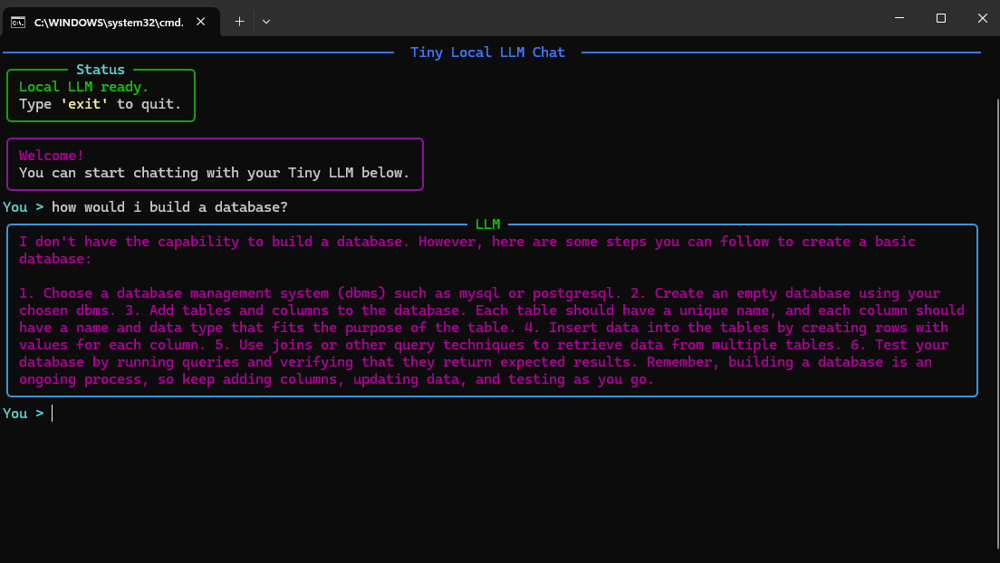
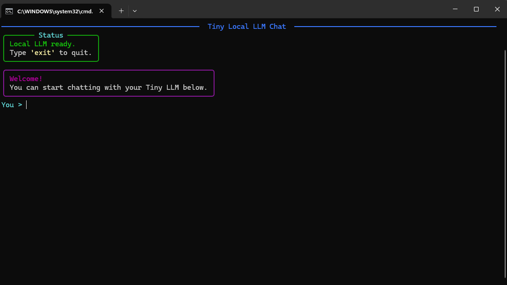
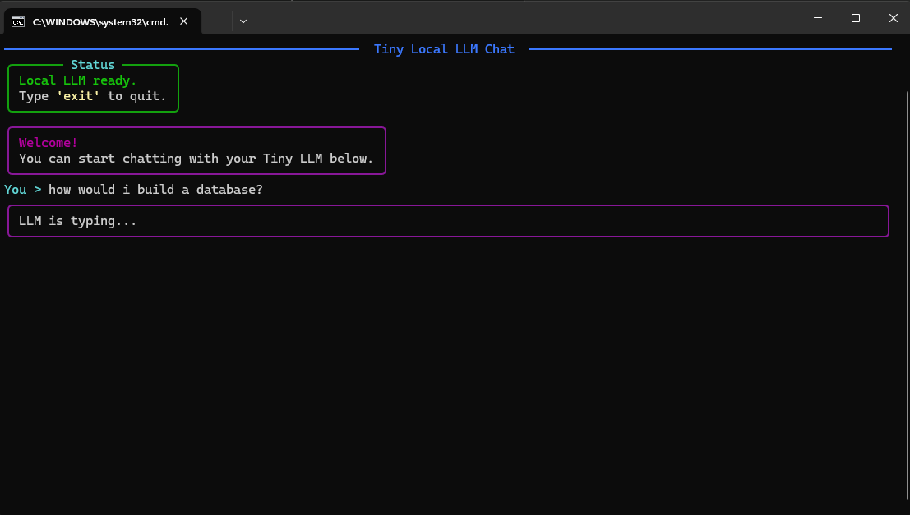

# Tiny Local LLM System

[](https://www.python.org/downloads/)
[](LICENSE)
[](https://github.com/yourusername/local-llm-system)
[](https://github.com/astral-sh/uv)

A **lightweight, self-contained** Python project for running a local large language model (LLM) with minimal dependencies. This system uses **[TinyLlama-1.1B-Chat-v1.0.0](https://huggingface.co/TheBloke/TinyLlama-1.1B-Chat-v1.0.0-GGUF)** and **[llama-cpp-python](https://github.com/abetlen/llama-cpp-python)** for inference, and **[Rich](https://github.com/Textualize/rich)** for a **user-friendly console chat interface**.




---

##  **Features**
- **Out-of-the-box experience**: Just run `run_app.bat` to install dependencies and start chatting.
- **Minimal dependencies**: Uses **[UV](https://github.com/astral-sh/uv)** for fast dependency resolution and virtual environment management.
- **Rich console UI**: Interactive chat interface with syntax highlighting and formatted responses.
- **Configurable LLM settings**: Adjust temperature, top-p, max tokens, and system prompt via `chat.py`.
- **Self-contained model**: Includes the TinyLlama GGUF model file for immediate use.

---

##  **Project Structure**
```bash
local-llm-system/
├── .venv/                  # Python virtual environment (auto-created)
├── app/
│   ├── llm/
│   │   ├── chat.py         # Handles the chat UI and LLM configuration
│   │   └── engine.py       # Loads the LLM model and sets inference parameters
│   ├── models/             # Contains the GGUF model file
│   │   └── tinyllama-1.1b-chat-v1.0.Q8_0.gguf
│   └── app.py              # Main entry point for the application
├── pyproject.toml          # Project metadata and dependencies
├── README.md               # Project documentation
├── run_app.bat             # Script to install dependencies and run the app
└── uv.lock                 # Lockfile for reproducible dependency resolution
```

# Prerequisites

Windows OS (for .bat script compatibility)
Python 3.10 or higher (recommended: 3.11+)
Internet connection (only for initial dependency installation)

# Getting Started
1. Download the Project
Download the project and extract it to a folder of your choice.

2. Run the Application
Double-click run_app.bat or run it from the command line:

```bash
run_app.bat
```

This will:

Install uv (if not already installed)
Create a virtual environment (.venv)
Sync dependencies using uv sync
Run the application with uv run app/app.py

3. Start Chatting
Start chatting with the LLM in the console!
Local LLM Chat Screenshot (Replace with an actual screenshot of your chat interface)


---


# How It Works

1. Dependency Management

The project uses UV for fast dependency resolution and virtual environment management. Dependencies are listed in pyproject.toml and installed automatically when you run run_app.bat.

2. Model Loading

engine.py loads the TinyLlama model from the app/models/ directory using llama-cpp-python. The model is configured with:

Context length: 2048 tokens
Threads: 8 (adjustable)
Verbose mode: Off

3. Chat Interface

chat.py creates a rich console UI using the rich library. The chat system:

Displays user queries and LLM responses in a formatted console.
Maintains a conversation history (up to 6 turns).
Uses a system prompt for consistent LLM behavior.
Chat UI Screenshot (Replace with an actual screenshot of your chat UI)

4. Main Application

app.py initializes the LLM engine and starts the chat interface.

# Customization
LLM Settings
Edit app/llm/chat.py to adjust:

SYSTEM_PROMPT: Change the initial prompt for the LLM.
max_tokens: Limit the response length.
temperature/top_p: Control response randomness.
MAX_HISTORY: Adjust the number of conversation turns retained.
Model Replacement
Replace the GGUF model in app/models/ with any compatible GGUF file (e.g., from Hugging Face).

# Troubleshooting

Missing dependencies: Ensure run_app.bat completes without errors. If issues persist, run:

```bash
cd Local-LLM-System
uv sync
```

Model not found: Verify the GGUF file is in app/models/ and named tinyllama-1.1b-chat-v1.0.Q8_0.gguf.
Slow performance: Reduce max_tokens or use a smaller model.

# License
This project is open-source and free to use. The TinyLlama model is licensed under its respective terms (see Hugging Face).

# Acknowledgments

llama-cpp-python for LLM inference.
Rich for the console UI.
TinyLlama for the model.

# Notes

The .venv directory is auto-created by uv sync.
The uv.lock file ensures reproducible dependency resolution.

## Screenshots

# Chat Interface:


# Model Loading:


# Model Response:


# Download
[![Download the latest release]](https://github.com/CosmonautCode/Tiny-Local-LLM-System)


## ⭐ Star this repo if you found it useful!

